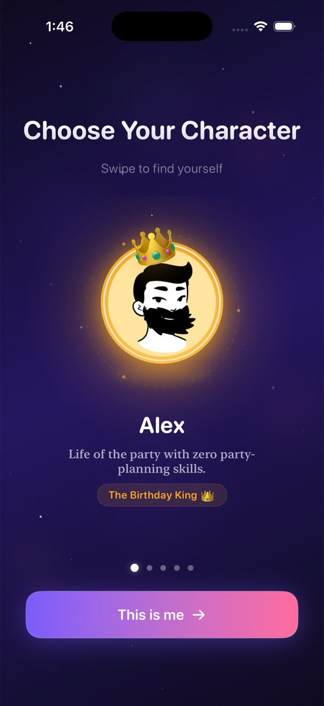
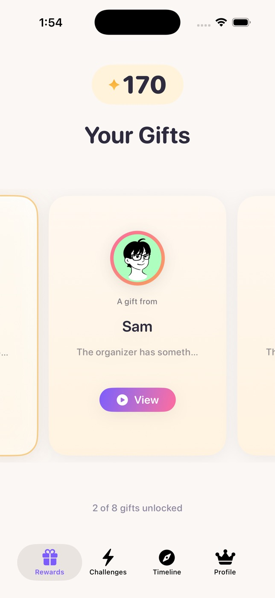
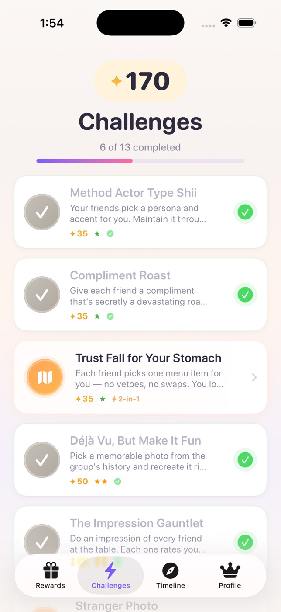
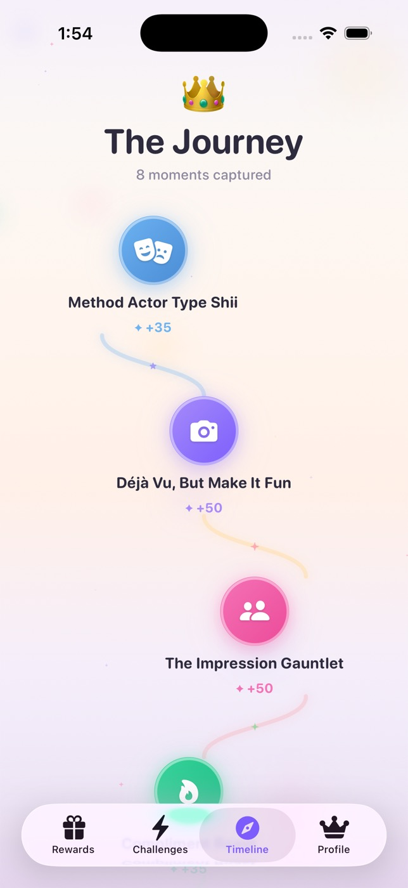
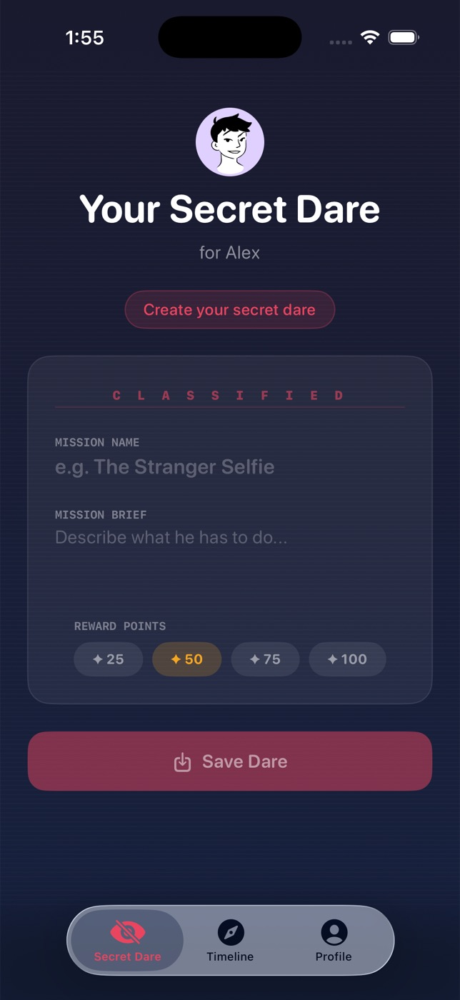
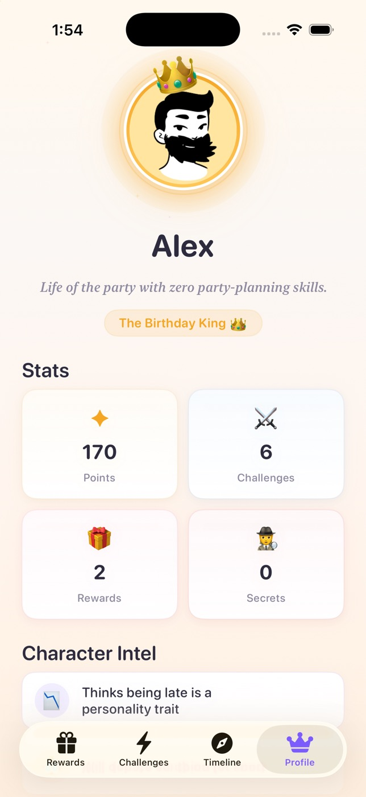

# BirthdayQuest

A gamified iOS birthday app where the birthday person completes challenges to earn points and spends them to unlock sentimental rewards — video messages, audio notes, photo galleries, and heartfelt text from friends and family. Built entirely in SwiftUI with a real-time Firebase backend.

## What It Does

Five people share the app. One is the birthday person. The other four are friends who each contribute a secret challenge and a reward. The birthday person earns points by completing fun, social, and creative challenges throughout their birthday weekend, then spends those points to unlock personalized gifts from the people who matter most.

A living timeline captures every moment — growing node by node with animated bezier paths as challenges are completed and rewards are unlocked. A mysterious final badge pulses at the bottom of the timeline, unlocking only when every reward has been claimed.

**The app is the gift.**

## Why This Exists

A friend's 30th was coming up and I didn't want to buy a thing. I wanted the people who care about
them to be the gift — but a group chat full of "happy birthday!!" messages is forgettable, and a
shared photo album is something you scroll once.

So I made the birthday person *earn* it. Five of us installed the app for a weekend. They completed
challenges we'd written, and every unlock revealed something one of us had recorded. By Sunday the
timeline had turned into a record of the whole weekend.

It worked. This repo is that app, with the real names and media stripped out, so you can make one
for someone you like.

## Screenshots

<p align="center">
  
  
  
</p>
<p align="center">
  
  
  
</p>

<p align="center">
  <em>Character Select &nbsp;·&nbsp; Rewards Carousel &nbsp;·&nbsp; Challenge Board &nbsp;·&nbsp; Living Timeline &nbsp;·&nbsp; Secret Dare &nbsp;·&nbsp; Profile</em>
</p>

## Features

### Rewards Carousel
Infinite-loop horizontal carousel with three card states: **locked** (frosted glass), **affordable** (pulsing gold glow), and **unlocked** (full color with playback). Unlocking triggers an atomic Firestore transaction that verifies the point balance, deducts points, marks the reward, and creates a timeline event — all in a single operation.

### Challenge Board
13 seeded challenges across four categories (social, creative, sentimental, adventure) with three difficulty tiers. Four challenges are **2-in-1** — presenting Option A / Option B via a toggle picker in the detail view. Submission is universal: every challenge offers Photo, Text, or Done proof options.

### Secret Challenges
Friends each create one classified dare through a spy-themed dossier interface with scan-line overlays and monospaced typography. The birthday person discovers these through a hidden "???" entry point that reveals a dark, classified sheet. Secret challenges are created, delivered, and completed through Firestore with real-time sync.

### Living Timeline
Vertical animated path with color-coded nodes: blue gradients for challenges, golden halos for rewards. Each node entrance is staggered with spring animations. The newest node breathes with a pulsing glow. Bezier trail connectors wind organically between nodes in an S-curve pattern with decorative sparkles at midpoints. A bokeh particle field and twinkling sparkle layer create a living background behind the path.

### Final Badge
Progressive glow intensifies as more rewards are unlocked. When the last reward is claimed, confetti erupts, haptics fire, and the badge transforms — revealed through a celebration sequence.

### Points Economy
Reward costs are tiered by content type (audio = 50, video = 100). The 8 seeded rewards cost **750 points**; the 13 seeded challenges award **715**. That gap is deliberate — the remaining points come from the secret challenges each friend authors in-app (50 points each), so unlocking the final badge requires everyone to participate, not just the birthday person. All point mutations use `FieldValue.increment` for safe concurrent updates, with transactions protecting balance-dependent operations.

### Additional Features
- **Character Select** — Video game lobby aesthetic with swipeable cards and device-locked claiming
- **Admin Controls** — Hidden organizer panel for managing game state, force-completing challenges, and triggering the final celebration
- **Skeleton Loading** — Screen-matched shimmer placeholders on every data view
- **Media Playback** — `VideoPlayerView` and `AudioPlayerView` with buffering states, error recovery, and proper AVPlayer lifecycle management
- **Design System** — Centralized `BQDesign` namespace with color palette, typography scale, spacing tokens, shadow presets, and animation curves

## Architecture

**MVVM + Services** with real-time Firestore synchronization.

```
┌─────────────┐     ┌──────────────────┐     ┌─────────────────┐
│    Views     │────▶│   ViewModels     │────▶│    Services      │
│  (SwiftUI)   │     │  (@MainActor)    │     │  (Firestore)     │
│              │◀────│  @Published      │◀────│  Listeners       │
└─────────────┘     └──────────────────┘     └─────────────────┘
       │                                              │
       ▼                                              ▼
┌─────────────┐                              ┌─────────────────┐
│ SessionMgr  │◀─────── Real-time sync ──────│   Firestore DB   │
│ (@EnvObject) │                              │   + Storage      │
└─────────────┘                              └─────────────────┘
```

### Key Patterns

- **SessionManager** — `@MainActor` singleton injected as `@EnvironmentObject`. Central hub for app state, navigation, and real-time game state sync. Views read points and progress from here, never from ViewModel computed properties (not observable).
- **FirestoreService** — Singleton with named listener keys to prevent collisions when multiple views subscribe to the same collection. Listener cleanup on view disappear.
- **Atomic Operations** — Reward unlocks use Firestore `Transactions` (read balance → verify → write). Challenge completions use Transactions with idempotency guards (read completion status → bail if already done → write).
- **Manual GameState Parsing** — Dictionary-based parsing with `NSNumber?.intValue` instead of Codable to handle Firestore's Int64/NSNumber type inconsistencies.
- **Timestamps** — `Timestamp(date: Date())` everywhere. `FieldValue.serverTimestamp()` is intentionally avoided because it breaks Codable decoding.

### Project Structure

```
BirthdayQuest/
├── Models/              5 Codable structs (User, Challenge, Reward, GameState, TimelineEvent)
├── Services/            FirestoreService, SessionManager, DataSeeder
├── ViewModels/          7 @MainActor ObservableObject classes
├── Views/
│   ├── CharacterSelect/ Swipeable character cards with claim flow
│   ├── BirthdayBoy/     Rewards carousel, challenge board, submission flow
│   ├── Friend/          Secret challenge creation (dossier UI)
│   ├── Timeline/        Animated path, bezier connectors, final badge
│   ├── Profile/         Stats, fun facts, admin controls
│   └── Components/      Avatar, media players, skeleton loaders, particles
├── Extensions/          Color+Hex, View+Extensions
├── DesignSystem.swift   BQDesign namespace (colors, typography, spacing, shadows, animations)
└── AppConstants.swift   Character IDs, Firestore collection names
```

## Tech Stack

| Layer | Technology |
|-------|-----------|
| UI | SwiftUI (iOS 26+) |
| Architecture | MVVM |
| Backend | Firebase Firestore (real-time listeners, transactions, batches) |
| Storage | Firebase Storage (media uploads, proof photos) |
| Identity | Device-locked character claim (`UserDefaults` + a `deviceId` field). **No user authentication** — see [SECURITY.md](SECURITY.md) |
| Animations | ConfettiSwiftUI, SwiftUI spring/easeInOut, Canvas particles |
| Media | AVKit + AVFoundation (video/audio playback with KVO observation) |
| Logging | OSLog Logger (structured logging with subsystem/category) |
| Avatars | Local CC0 assets, with a [DiceBear](https://dicebear.com) Open Peeps API fallback for unrecognized names |

## Firestore Schema

| Collection | Documents | Key Fields |
|------------|-----------|------------|
| `users` | 5 character profiles | name, role, avatarId, tagline, funFacts, claimed, deviceId |
| `challenges` | 13 seeded + user-created secrets | title, pointValue, difficulty, category, isSecret, isCompleted, proofUrl |
| `rewards` | 8 seeded rewards | fromName, pointCost, contentType, contentUrl/contentUrls, isUnlocked |
| `timeline_events` | Append-only | type, referenceId, title, subtitle, badgeType, timestamp |
| `game_state/main` | 1 singleton | currentPoints, challengesCompleted, rewardsUnlocked, finalBadgeUnlocked |

## Getting Started

### Prerequisites
- **Xcode 26 or newer** (the deployment target is iOS 26.0)
- A Firebase project ([console.firebase.google.com](https://console.firebase.google.com))

### Setup

```bash
git clone https://github.com/mit112/BirthdayQuest.git
cd BirthdayQuest
open BirthdayQuest/BirthdayQuest.xcodeproj
```

1. **Create a Firebase project** and enable **Cloud Firestore** and **Firebase Storage**.

2. **Deploy the security rules.** This repo ships `firestore.rules` and `storage.rules`:

   ```bash
   npm install -g firebase-tools
   firebase login
   firebase use --add          # select your project
   firebase deploy --only firestore:rules,storage
   ```

   If you skip this and leave Firestore in **production** mode, every read is denied and the app
   opens to an empty Character Select screen with no error message. If you'd rather not use the
   CLI, set Firestore to **test mode** in the console instead.

3. **Add your Firebase config.** Download `GoogleService-Info.plist` from the Firebase Console
   (Project Settings → Your apps → iOS) and save it to `BirthdayQuest/BirthdayQuest/`. See
   [`GoogleService-Info.plist.example`](GoogleService-Info.plist.example) for the expected keys.

   The project uses Xcode folder-synced groups, so dropping the file in that directory is enough —
   no Xcode configuration needed. Note that the app **builds fine without it** and instead crashes
   at launch with a message pointing you here.

4. **Set your Team ID** in Xcode → Signing & Capabilities (Xcode prompts automatically). Please
   leave that change out of any commit.

5. **Build and run.** `DataSeeder` populates Firestore with the sample characters, challenges, and
   rewards on first launch.

> **The rewards will be empty on a fresh clone.** Every seeded reward ships with an empty
> `contentUrl`, so unlocking one shows "Content loading soon" until you add your own media. That's
> the next section.

### Customization

To personalize for your own birthday celebration:

- **Characters** — Edit `DataSeeder.seedUsers()` with your own names, taglines, and fun facts
- **Challenges** — Edit `DataSeeder.seedChallenges()` to add your own challenges
- **Rewards** — Upload media to Firebase Storage under `rewards/{rewardId}/{filename}`, then paste each HTTPS download URL into the `contentUrl` field in `DataSeeder.seedRewards()` (or edit the Firestore documents directly). Image rewards use `contentUrls: [String]` instead
- **Avatars** — Replace images in `Assets.xcassets/avatar-*.imageset` with your own illustrations
- **Design** — All visual tokens live in `DesignSystem.swift` under the `BQDesign` namespace

### Build

```bash
xcodebuild -project BirthdayQuest/BirthdayQuest.xcodeproj \
  -scheme BirthdayQuest \
  -destination 'platform=iOS Simulator,name=iPhone 17 Pro' \
  build
```

## Design

The visual language follows a **"Headspace meets Duolingo"** philosophy — warm, playful, and alive.

**Color palette:** Soft purples (`#7C5CFC`), warm pinks (`#FF6B9D`), golden accents (`#F5A623`), cream backgrounds (`#FBF7F4`). Primary actions use a purple-to-pink gradient. Rewards glow gold. Secret challenges use a dark navy palette with red accents.

**Typography:** Rounded design system (SF Rounded) with a clear hierarchy from 34pt hero titles down to 11pt captions. Serif taglines for personality.

**Motion:** Spring animations for entrances, breathing glows for active states, staggered reveals for lists, confetti + haptics for celebrations. Background particle systems (bokeh circles, twinkling sparkles) with deterministic positioning to prevent flicker on re-renders.

## Technical Highlights

A few implementation details worth noting:

- **Atomic Firestore operations** — Reward unlocks and challenge completions use transactions with idempotency guards, preventing double-tap exploits and partial-failure corruption
- **Real-time sync** — `SessionManager` maintains a single game state listener that all views observe through `@EnvironmentObject`, ensuring points and progress are always consistent across tabs
- **Infinite carousel** — 5x loop multiplier with silent boundary-jump logic for seamless infinite scrolling without the memory cost of inflating hundreds of views
- **Canvas-rendered overlays** — Scan-line effects use `Canvas` draw calls instead of hundreds of `Rectangle` views
- **Structured logging** — All services use `OSLog.Logger` with subsystem/category for filterable, level-aware logging
- **Deterministic animations** — Background particles derive positions and durations from seed indices, not `random()`, preventing visual jumps on tab re-entry

## Known Limitations

Being upfront, because these will bite you if you deploy it:

- **No user authentication.** Identity is a device-locked character claim in `UserDefaults`, not an
  authenticated session. Security rules can restrict the *shape* of writes but not *who* makes them.
  See [SECURITY.md](SECURITY.md).
- **Reward media URLs are public links.** Anyone with the URL can view the media, forever, with no
  credential. Don't put anything genuinely private behind a reward.
- **There's a hardcoded override PIN** (`1234`) so an organizer can undo a mis-tap on the day.
  Change it before you deploy.
- **Single game instance.** One `game_state/main` document, five hardcoded character IDs. It hosts
  exactly one celebration at a time.
- **No meaningful test coverage.** The test targets exist but contain only Xcode's template stubs.
  `FirestoreService` is a singleton with no protocol seam, so nothing is mockable yet — that's the
  blocker, and fixing it is the top item on my list.
- **No accessibility support yet.** No VoiceOver labels on the custom controls, no Dynamic Type, no
  reduce-motion handling — and this app animates a lot. Light mode only.
- **iOS 26.0 minimum.** Set during development to use the newest SwiftUI APIs; it does limit who
  can build it.

## Credits

- Avatars generated with [DiceBear](https://dicebear.com) — Open Peeps by Pablo Stanley and Lorelei
  by Lisa Wischofsky, both CC0 1.0 (public domain, no attribution required — credited anyway)
- Confetti by [ConfettiSwiftUI](https://github.com/simibac/ConfettiSwiftUI) (MIT)
- Backend by [Firebase](https://firebase.google.com) (Apache-2.0)

Built with heavy AI assistance (Claude Code) for scaffolding, code review, and documentation. The
architecture, design direction, and every product decision are mine.

## License

MIT License. See [LICENSE](LICENSE) for details.

Contributions welcome — see [CONTRIBUTING.md](CONTRIBUTING.md).

---

Built with SwiftUI + Firebase.
